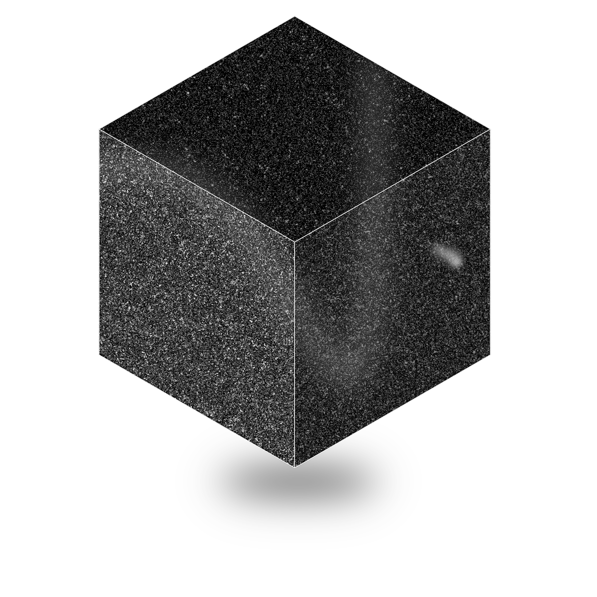

<div align="center">
  

  # Forge

  ### **The Local-First, Privacy-Respecting AI IDE**
  Forge is an open-source IDE forked from VS Code and built on top of the Void editor codebase. It is designed from the ground up for developers who demand complete code privacy, offline capabilities, and zero telemetry.

  <p align="center">
    <a href="LICENSE.txt"></a>
    
    
    
  </p>

  <p>
    <a href="#-key-pillars">Key Pillars</a> •
    <a href="#-features">Features</a> •
    <a href="#-screenshots">Screenshots</a> •
    <a href="#-quick-start">Quick Start</a> •
    <a href="#-architecture">Architecture</a>
  </p>
</div>

---

## 🧭 Key Pillars

### 🔒 100% Local & Offline First
Forge completely removes dependency on third-party cloud LLMs. Instead, it provides a built-in provider layer to connect directly with your locally-running models.

### 🕵️ Zero Telemetry & Privacy Guarding
All tracking, analytics, and metrics-reporting services are completely gutted. Forge will never send your code, prompts, or usage metrics to external servers.

### 🔌 Open Extensions via Open VSX
Forge uses the open-source **Open VSX Registry** instead of the proprietary Microsoft Marketplace, giving you access to thousands of extensions without proprietary tracking.

---

## ✨ Features

- **Local LLM Providers Built-in:** Native support for:
  - **Ollama** (via `/api/chat` and `/api/generate` for FIM/autocomplete)
  - **LM Studio** (via OpenAI compatible APIs)
  - **vLLM**, **Llama.cpp**, and **LocalAI** out-of-the-box.
- **Provider Auto-Discovery:** A background registry service polls your local services (Ollama on `11434`, Llama.cpp on `8080`, etc.) and displays a live connection status dot:
  - ● **Green:** Connected and ready.
  - ● **Amber:** Checking connection status.
  - ● **Red:** Connection error/offline.
  - ● **Grey:** Disabled/Unknown.
- **Defence-in-Depth HTTP Guard:** To guarantee your code privacy, Forge's network utilities refuse to send outgoing requests to non-localhost URLs. Your prompt data is physically locked inside your machine.
- **Redesigned Agents Window:** A dedicated 3-panel workspace interface (Copilot-style) to manage autonomous AI coding agents:
  - **Left Sidebar**: Session thread browser and Customizations panel with quick emojis (Overview, Agents, Skills, Instructions, Hooks, MCP, Plugins, Tools).
  - **Center Panel**: The core chat stream, welcome roadmap, auto-approval toggles, and token stream.
  - **Right Sidebar**: Collapsible view tracking Changes and workspace files side-by-side.
- **React + Tailwind Workbench Integration:** Forge compiles React and scopes Tailwind CSS, making it easy to create beautiful, modern UI components directly inside the IDE layout.
- **Code Streaming & Diffing:** Inline editing (Cmd+K) and Sidebar Chat (Cmd+L) stream model outputs token-by-token and render side-by-side diffs.

---

## 📸 Screenshots

<div align="center">
  
  <p><em>The elegant, local-first user interface of Forge IDE.</em></p>
</div>

---

## 🚀 Quick Start (macOS / Linux)

### Prerequisites

- **Node.js** version `20.18.2` (configured via `.nvmrc`)
- **Python** (for building native node modules)
- **C++ Compiler** (Xcode Command Line Tools on macOS or `build-essential` on Linux)

### Installation & Build

1. Clone the repository and navigate into it:
   ```bash
   cd Forge
   ```

2. Load the correct Node version and install dependencies:
   ```bash
   source ~/.nvm/nvm.sh && nvm use
   npm install
   ```

3. (Xcode 26+ / Apple Clang 21 on macOS) Patch spdlog build if needed:
   ```bash
   ./scripts/patch-spdlog-xcode26.sh
   ```

4. Build native modules and compile React/Tailwind frontend bundles:
   ```bash
   npm rebuild
   node build/npm/postinstall.js
   npm run buildreact
   ```

5. Compile the main VS Code codebase:
   ```bash
   npm run compile
   ```

### Running Forge in Developer Mode

To run Forge with live-reloads:

1. In the first terminal window, start the watcher:
   ```bash
   npm run watch
   ```
   *(Wait ~2 minutes until compiler checkmarks appear)*

2. In a second terminal window, launch the Forge desktop client:
   ```bash
   ./scripts/code.sh \
     --user-data-dir "$(pwd)/.tmp/user-data" \
     --extensions-dir "$(pwd)/.tmp/extensions"
   ```

---

## 🛠️ Architecture

Forge extends the VS Code electron-main and renderer architectures:
* **`ILocalProvider` Interface** (`src/vs/workbench/contrib/void/common/forgeProviderTypes.ts`): Outlines the capabilities of local LLMs including `streamChat`, `streamFIM`, `healthcheck`, and `listModels`.
* **Auto-Discovery Service** (`src/vs/workbench/contrib/void/common/forgeProviderRegistryService.ts`): Runs a background polling loop to automatically discover active LLM runtimes on localhost.
* **HTTP Guard** (`src/vs/workbench/contrib/void/common/forge/httpUtil.ts`): Intercepts all provider requests and enforces a strict local-only policy, blocking outgoing web requests to remote endpoints.
* **UI Mounts** (`src/vs/workbench/browser/workbench.ts`): Bootstraps React roots to render the sidebar chat, settings page, and Agents window.

---

## 📄 License

Forge is licensed under the MIT License and contains source code derived from Microsoft VS Code (MIT) and Void (Apache 2.0). See [LICENSE.txt](LICENSE.txt) for details.
